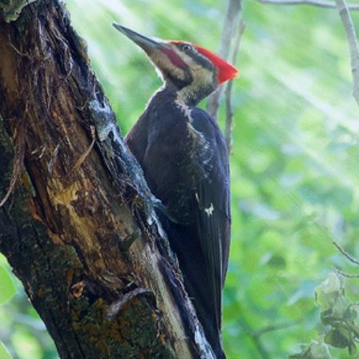
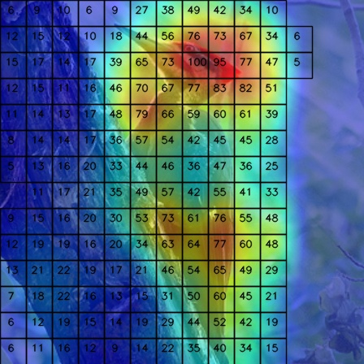
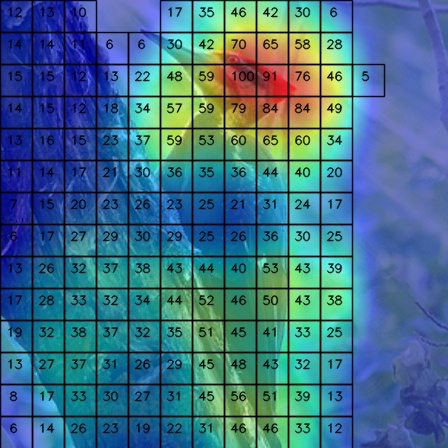
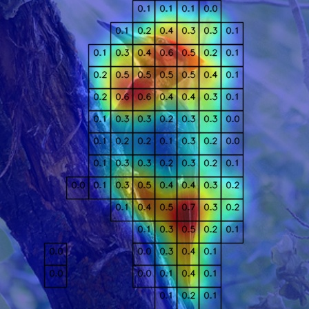
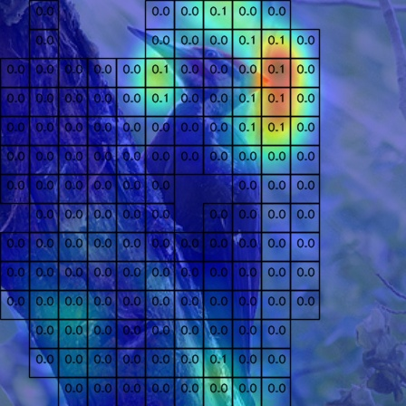
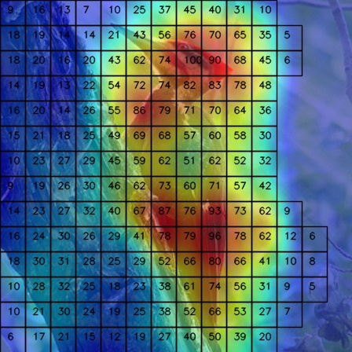
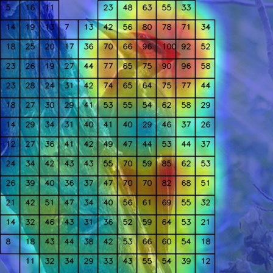

# CAPE: CAM as a Probabilistic Ensemble for Enhanced DNN Interpretation

[CAPE: CAM as a Probabilistic Ensemble for Enhanced DNN Interpretation, CVPR 2024]()

Created by Townim Faisal Chowdhury, Kewen Liao, Vu Minh Hieu Phan, Minh-Son To, Yutong Xie, Kevin Hung, David Ross, Anton van den Hengel, Johan W. Verjans, and Zhibin Liao

# Introduction

The research paper addresses the problems with the class activation map (CAM) method's analytical ability. The current CAM methods don't show any relationship between the class confidence score and the generated heatmap. So, we propose a novel method, CAPE to clearly show how the model's attention map and decision process are connected. To put it another way, the model's outputs can be explained by the fact that the sum of the image region-wise attention values in CAPE is the same as the class confidence score predicted by the model.

<table border="1">
  <tr>
    <td style="text-align: center;">Input</td>
    <td style="text-align: center;">Method</td>
    <td style="text-align: center;">Top-1 Prediction</td>
    <td style="text-align: center;">Top-2 Prediction</td>
    <!-- <td style="text-align: center;"> &micro;-CAPE (PF) [41.3%]</td> -->
  </tr>
  <tr>
    <td rowspan="6" style="text-align: center;">
    
    <br>Ground Truth: Pileated Woodpecker
    </td>
    <td style="text-align: center;">CAM</td>
    <td style="text-align: center;">
    
    <br>Pred: 97.8% <br>Class: Pileated Woodpecker
    </td>
    <td style="text-align: center;">
     
    <br>Pred: 1.3% <br>Class: Red headed Woodpecker
    </td>
  </tr>
  <tr>
    <td style="text-align: center;">CAPE (TS)</td>
    <td style="text-align: center;">
    
    <br>Pred: 21.9% <br>Class: Pileated Woodpecker
    </td>
    <td style="text-align: center;">
     
    <br>Pred: 0.3% <br>Class: Red headed Woodpecker
    </td>
  </tr>
  <!-- <tr>
    <td style="text-align: center;">&micro;-CAPE (PF)</td>
    <td style="text-align: center;">
    
    <br>Pred: 21.9% <br>Class: Pileated Woodpecker
    </td>
    <td style="text-align: center;">
     
    <br>Pred: 0.3% <br>Class: Red headed Woodpecker
    </td>
  </tr> -->
</table>


## Usage
The code has been thoroughly tested on a single Nvidia RTX A6000 GPU and Python 3.10.10, running on Ubuntu 22.04.4 LTS. Please install [PyTorch](https://pytorch.org/get-started/locally/) with necessary packages in [requirements.txt](requirements.txt).
```
pip install -r requirements.txt
```

### Configurations
Here, we only include the configuration for the [CUB]( http://www.vision.caltech.edu/visipedia/CUB-200-2011.html) experiment. 
The configuration files pertinent to this experiment can be found within the [configs/cub](configs/cub) folder. Essential components such as the dataset and augmentations are specified in [datasets.py](datasets.py) and [transforms.py](configs/transforms.py) respectively.
You can create similar configuration files, and  for other datasets. 

Also, we provide the trained models of TS and PF settings for the [CUB]( http://www.vision.caltech.edu/visipedia/CUB-200-2011.html) in [saved_models](./saved_models) folder.

### Model Training
There are two ways to train the model: **training from scratch (TS)** and **post-fitting (PF)**.

The **first approach (TS)** involves training the network from scratch, with both loss weights set to 1. The backbone model receives gradients from the vanilla classification layer rather than the CAPE layer.

Conversely, the **second approach (PF)** involves training solely the CAPE layer, leaving the backbone and vanilla classifier layer frozen. The weight of the vanilla classifier layer will be used to initialize the CAPE layer, and the weight of the classification loss will be zero. This approach is more resource and time efficient when there are a lot of training samples with available pre-trained models, such as the ImageNet dataset.

For TS training:
```
python main.py --dataset cub --seed 123 --config_file configs/cub/resnet50_TS.py
```

For PF training:
```
python main.py --dataset cub --seed 123 --config_file configs/cub/resnet50_PF.py
```

### CAM Map Generation
You can generate CAM maps using this command:
```
python generate_cam_maps.py --image_path <img_path> --model_path <model_path> --dataset_transform <transform_function_inconfigs_transforms.py> --save_dir <save_dir> --cam_maps <cam/cape/mu-cape>
```


## Citation

```bibtex
@inproceedings{CAPE,
	title        = {{CAPE}: {CAM} as a Probabilistic Ensemble for Enhanced DNN Interpretation},
	author       = {Faisal Chowdhury, Townim and Liao, Kewen and Minh Hieu Phan, Vu and To, Minh-Son and Xie, Yutong and Hung, Kevin and Ross, David and Hengel, Anton van den and W. Verjans, Johan and Liao, Zhibin},
	year         = 2024,
	booktitle    = {IEEE / CVF Computer Vision and Pattern Recognition Conference (CVPR)}
}

```